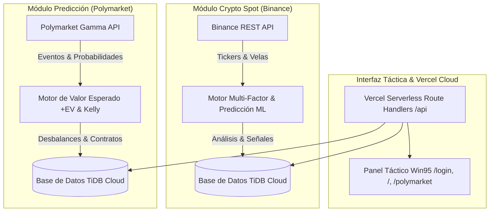

# TRADEMERC - Plataforma de Trading Cripto ML & Predicción en Polymarket

TRADEMERC es una plataforma de trading algorítmico y predicción cuantitativa de grado de producción. Cuenta con dos módulos tácticos completamente independientes:

1. **Módulo Crypto Spot Bot (Binance)**: Ingesta de datos de mercado en tiempo real, 10 indicadores técnicos (EMA, RSI, MACD, Bollinger Bands, ATR, ADX, StochRSI, OBV, VWAP, Volume Profile), motor de predicción ML con regresión lineal OLS y reconocimiento de patrones de velas japonesas.
2. **Módulo Polymarket Bot (+EV Prediction Engine)**: Ingesta de eventos en tiempo real desde la API Gamma de Polymarket, cálculo de Valor Esperado (+EV), gestión de riesgo con Criterio de Kelly y compra simulación de contratos YES/NO.

---

## 🛠️ Arquitectura del Sistema



---

## 🎯 Componentes Principales

1. **Plano de Control & API Serverless (`frontend/src/app/api/`)**: Endpoints en Vercel para control de bot, estatus, logs en vivo, tickers, órdenes, posiciones y analítica de rendimiento.
2. **Motor de Predicción Machine Learning (`backend/app/services/strategy_service.py`)**:
   - Proyección de precios con Regresión Lineal OLS a 3 velas futuras (R² fit score).
   - Detección de patrones de velas japonesas (*Hammer, Engulfing, Doji, Morning Star, Evening Star, Three White Soldiers*).
   - Divergencias de precio vs RSI.
   - Clasificador adaptativo de régimen de mercado (*TRENDING_UP, TRENDING_DOWN, RANGING, VOLATILE*).
3. **Motor de Valor Esperado Polymarket (`frontend/src/app/api/polymarket/`)**:
   - Algoritmo de ventaja matemática $+EV \ge 8\%$.
   - Dimensionamiento de posición mediante Criterio de Kelly.
   - Categorías: Cripto, Macroeconomía, Política y Tecnología.
4. **Base de Datos TiDB Cloud MySQL**: Conexión segura SSL para persistencia de logs, señales, posiciones y métricas de rendimiento.
5. **Interfaz Táctica Win95 (`frontend/src/`)**: Panel de control retro con aislamiento 100% entre entornos, selector post-login con botones cuadrados y pantalla de carga con barra de progreso animada.

---

## 🚀 Despliegue en la Nube 24/7 (Sin Costos)

- **Web & API Serverless**: Desplegado en **Vercel** en 👉 **[https://trade-merc.vercel.app](https://trade-merc.vercel.app)**
- **Base de Datos**: Alojada en **TiDB Cloud MySQL**.
- **Ejecución Automática**: Configurada con **GitHub Actions** (`.github/workflows/bot-worker.yml`) para operar gratis 24/7 en la nube sin necesidad de mantener computadoras encendidas.

---

## 💻 Desarrollo Local

### Configuración del Frontend:
```bash
cd frontend
npm install
npm run dev
```
*La aplicación estará disponible en `http://localhost:3000`.*

### Configuración del Backend (Opcional):
```bash
cd backend
pip install -r requirements.txt
python run.py
```
