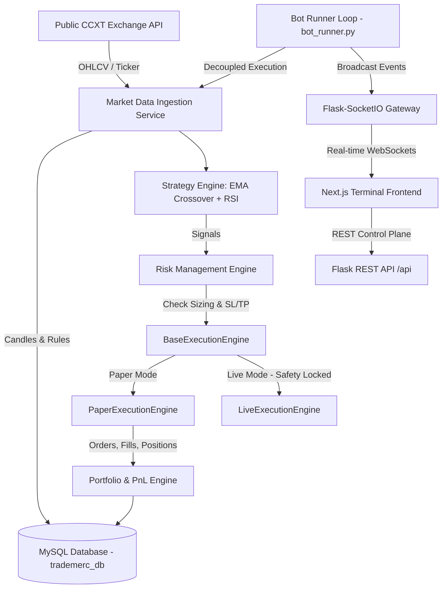

# TradeMerc - Algorithmic Crypto Paper Trading Platform

TradeMerc is a production-grade algorithmic cryptocurrency paper trading platform. It ingests **real-time public market data via CCXT**, calculates technical indicators, evaluates quantitative strategy signals, enforces strict risk management rules, simulates realistic order execution (with fees, slippage, min notional, and quantity/price precision), persists all operational state in **MySQL**, and broadcasts live telemetry to a Next.js terminal dashboard via **Flask-SocketIO**.

---

## System Architecture



---

## Core Components

1. **API / Control Plane (`backend/app/routes/`)**: REST API endpoints for bot control, configuration, dashboard summaries, candles, orders, signals, analytics, and exchange credentials.
2. **Bot Worker / Execution Loop (`backend/worker/bot_runner.py`)**: Autonomous daemon loop running independently from Flask HTTP request threads.
3. **Execution Engine Abstraction (`backend/app/services/execution/`)**:
   - `BaseExecutionEngine`: Common interface.
   - `PaperExecutionEngine`: Fully functional simulation with min notional, quantity/price rounding, fee deduction, slippage, and PnL calculation.
   - `LiveExecutionEngine`: Future-ready private CCXT execution engine, safety locked via `LIVE_TRADING_ENABLED=false` environment guards.
4. **Risk Engine (`backend/app/services/risk_service.py`)**: Sizing calculation based on risk per trade %, automated Stop-Loss/Take-Profit triggers, circuit breaker on max drawdown (15%), position count limits.
5. **Persistence Layer (`backend/app/models/` & `schema.sql`)**: Complete 19-table MySQL database schema with indexes, foreign keys, and UTC timestamps.
6. **Realtime Gateway (`backend/app/sockets/events.py`)**: Flask-SocketIO event push for live terminal updates.
7. **Frontend Terminal (`frontend/`)**: Modern Next.js 14 app with TradingView Lightweight Charts, Tailwind CSS dark theme, and interactive control panels.

---

## Live Readiness Strategy (Zero-Downtime Live Transition)

TradeMerc is architected to switch from Paper Mode to Live Mode with zero structural changes:
1. `exchange_credentials` table securely stores encrypted API key, secret, and passphrase using local Fernet AES encryption (`backend/app/utils/encryption.py`).
2. `BaseExecutionEngine` polymorphic interface allows swapping `PaperExecutionEngine` with `LiveExecutionEngine`.
3. System guard: `LIVE_TRADING_ENABLED=false` is enforced globally in `.env` and `LiveExecutionEngine` raises explicit execution blocks unless explicitly enabled.

---

## Installation & Running Locally (No Docker Required)

### Step 1: Database Setup (MySQL)
1. Ensure MySQL Server is running locally on `localhost:3306`.
2. Create the database and run the schema script:
   ```bash
   mysql -u root -p -e "CREATE DATABASE IF NOT EXISTS trademerc_db CHARACTER SET utf8mb4 COLLATE utf8mb4_unicode_ci;"
   mysql -u root -p trademerc_db < backend/schema.sql
   ```

### Step 2: Backend Setup
```bash
cd backend
python -m venv venv
# On Windows:
venv\Scripts\activate
# On Linux/macOS:
# source venv/bin/activate

pip install -r requirements.txt
python run.py
```
*The backend server will run on `http://localhost:5000` and automatically start the background bot execution worker thread.*

### Step 3: Frontend Setup
```bash
cd frontend
npm install
npm run dev
```
*The frontend terminal will run on `http://localhost:3000`.*

---

## Project Structure

```
trade-merc/
├── backend/
│   ├── app/
│   │   ├── models/           # 19 SQLAlchemy models
│   │   ├── repositories/     # Data query repositories
│   │   ├── routes/           # REST API blueprints
│   │   ├── services/         # Domain services & execution engines
│   │   │   └── execution/    # Base, Paper, and Live execution engines
│   │   ├── sockets/          # Flask-SocketIO event gateway
│   │   ├── utils/            # AES Encryption, helper functions
│   │   └── config.py         # Config loader
│   ├── worker/               # Decoupled bot execution loop
│   ├── schema.sql            # MySQL schema initialization script
│   ├── requirements.txt      # Python dependencies
│   ├── run.py                # Server & worker launcher
│   └── .env.example
├── frontend/
│   ├── src/
│   │   ├── app/              # Next.js App Router pages
│   │   ├── components/       # Layout, Navbar, Sidebar, StatCards, Charts
│   │   ├── features/         # Dashboard, Market, Bot Control, Exchange, Trades, Analytics, Logs
│   │   ├── hooks/            # Socket.IO hooks
│   │   ├── lib/              # API client and Socket singleton
│   │   └── types/            # TypeScript definitions
│   ├── package.json
│   ├── tailwind.config.ts
│   └── .env.local.example
└── README.md
```
